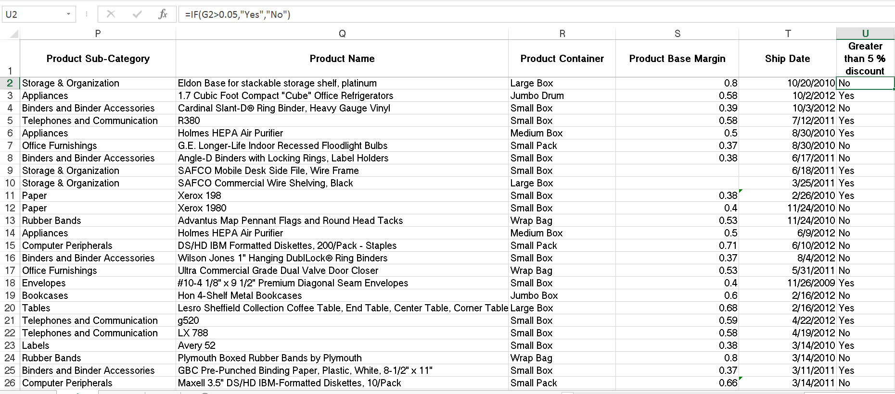
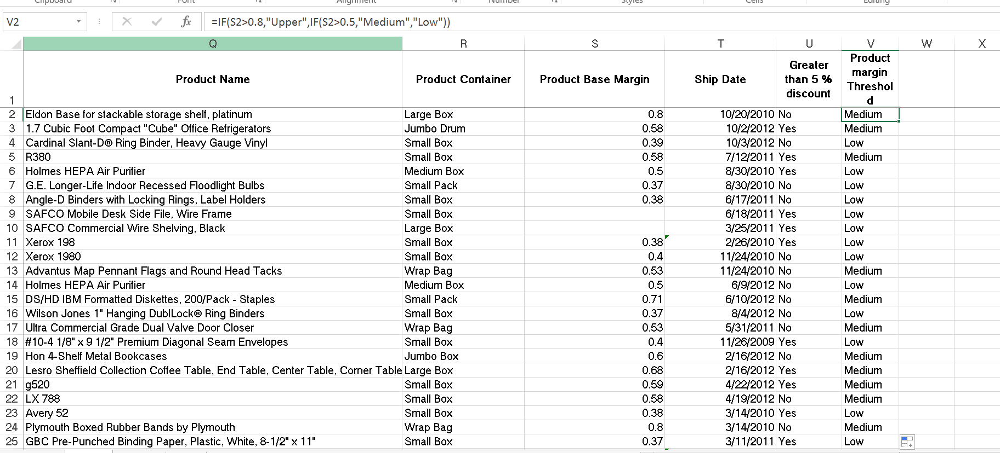

# IF Condition

One of the most commonly used functions in Excel is the ‘IF’ function.Its usefulness and application are quite broad due to its simplicity.

**"It is a logical function that basically allows the user to specify results based on whether or not a specific criterion is met."**

The result hinges upon either a true or false outcome of a logical test. Think of it in terms of ‘if this is true, then that – otherwise (if ‘this’ is false) something else’. Obviously, this is very simple and straightforward yet it is incredibly powerful as well.

## True or false

The ‘IF’ function is a logical function which basically means its results are based on one of two outcomes: true or false.
true or false

The user sets the criteria by which the function evaluates whether it is indeed true or false.

Then the function allows us to dictate what it returns in either of those cases!

**The syntax of the ‘IF’ function is so simple making its concept fairly easy to grasp:**

**`=IF(logicaltest,[valueiftrue],[valueif_false])`**

French
**`=SI(un élément est vrai, action à effectuer, sinon autre action) `**

Now open the SuperstoresSales.xls sheet. Now lets create a new column to check whether the product has more than 5% discount.

Now create another column to check whether the customer segment is "Home office". Return Yes or No . Name the column Home Office.

## Nesting the ‘IF’ function

Nesting ‘IF’ functions is especially useful when another ‘IF’ logical needs to be addressed as the result of the outcome of either the ‘value_if_true’ or ‘value_if_false’ arguments.

In the SuperstoresSales.xls , Lets create a new column called "Product margin threshold". based on the below table lets create a threshold

Product margin  |  Threshold
--|--
  >0.8|"Upper"  
  >0.5|"Medium"
  <0.5|"Low"  

